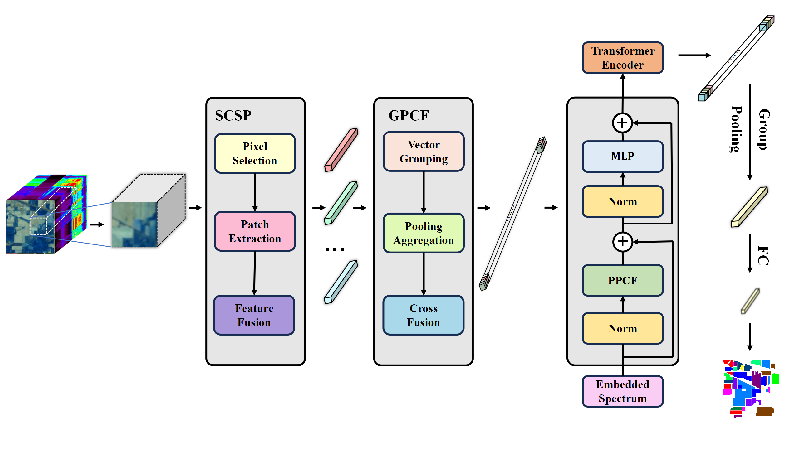
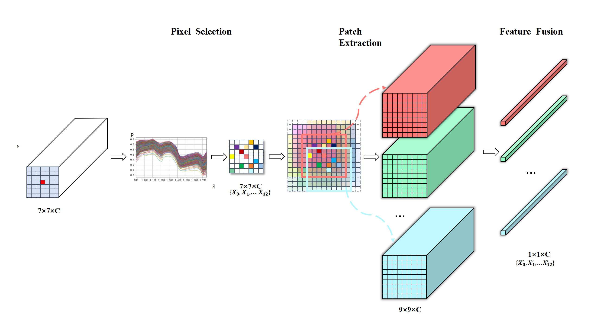
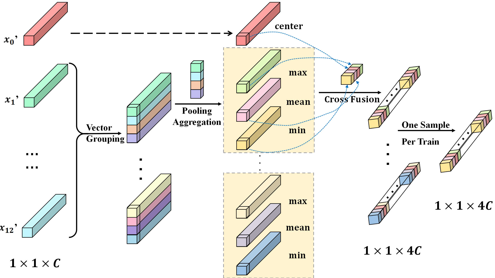
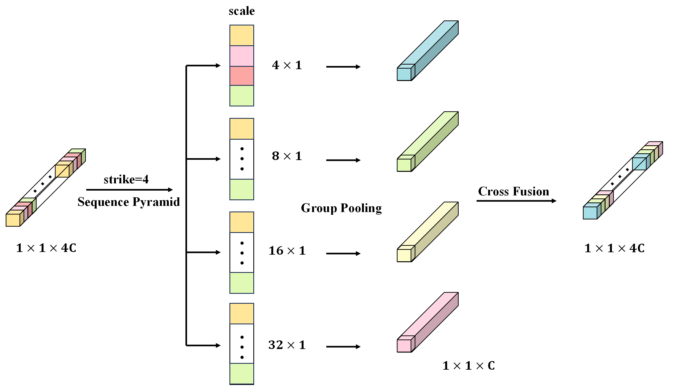

# DPCFFormer: Lightweight Transformer with Diverse Pooling and Cross Feature Fusion for Hyperspectral Image Classification

___________

**Figure 1: Overall block diagram of the DPCFFormer mode.**

**Figure 2: Flowchart of SCSP module.**

**Figure 3: Flowchart of the GPCF module.**

**Figure 4: Flowchart of the PPCF module.**

DPCFFormer is a lightweight Transformer-based model for hyperspectral image classification (HSIC). It replaces traditional attention mechanisms with parameter‑free pooling and cross‑fusion modules, achieving high accuracy with significantly fewer parameters. The model consists of three novel components:

SCSP (Spectral‑Correlation and Spatial‑Pooling): Selects the most correlated neighboring pixels using spectral correlation, then performs overlapping patch extraction and pooling.

GPCF (Group‑Pooling and Cross‑Feature Fusion): Groups selected feature vectors, applies multi‑mode pooling (min/mean/max), and fuses them with the center pixel to form 1‑D long sequences.

PPCF (Pyramid‑Pooling and Cross‑Feature Fusion): Replaces multi‑head self‑attention with multi‑scale pooling and cross‑fusion, drastically reducing parameters.

Requirements
---------------------
    
    python==3.11
    numpy==1.26.3
    matplotlib==3.9.0
    scipy==1.13.1
    scikit-learn==1.5.0
    torch==2.3.1+cu121

Instructions
---------------------
    
    DPCFFormer/
    ├── model.py           # DPCFFormer model architecture (PPCF, Encoder, GroupPooling)
    ├── preprocessing.py   # SCSP and GPCF modules, correlation cache precomputation
    ├── train.py           # Training, evaluation, and classification map generation
    ├── utils.py           # Data loading, mirror padding, metrics, cache I/O
    ├── datasets/          # Placeholder – download HSI datasets here
    ├── corr_cache/        # Precomputed correlation caches (auto‑generated)
    ├── results/           # Saved models and classification maps
    └── README.md

